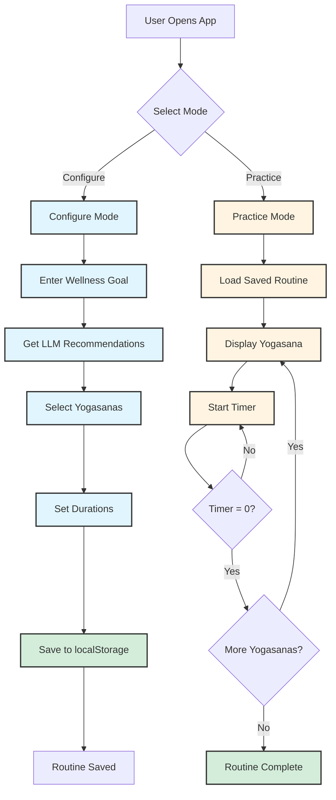
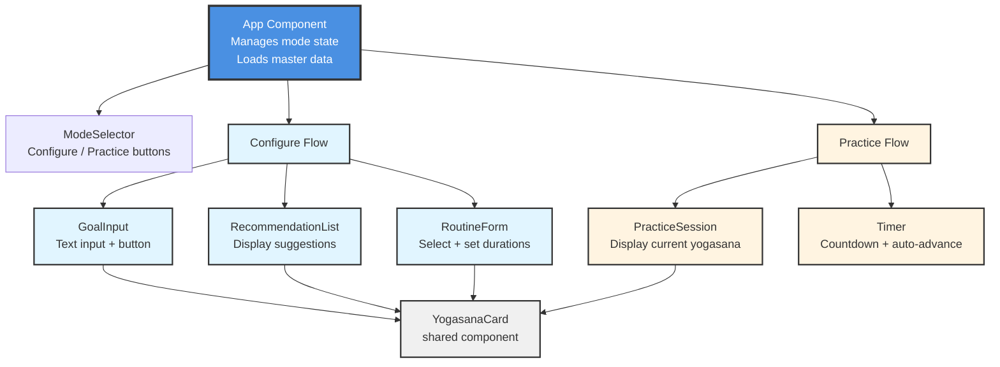
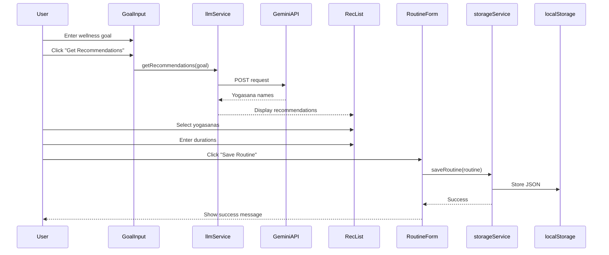
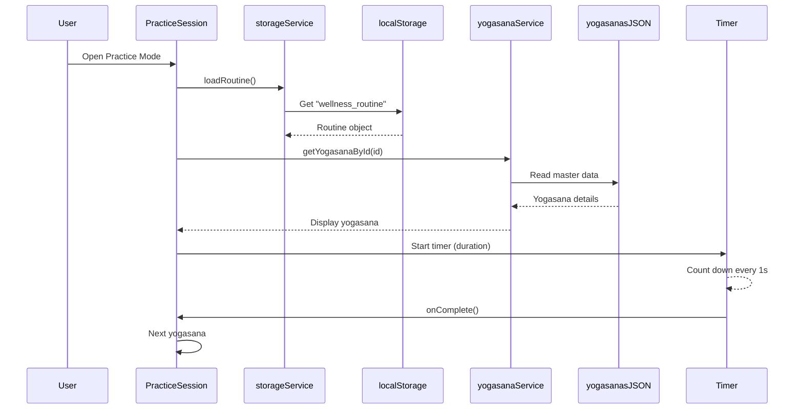
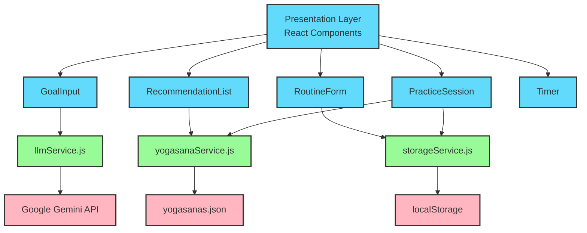
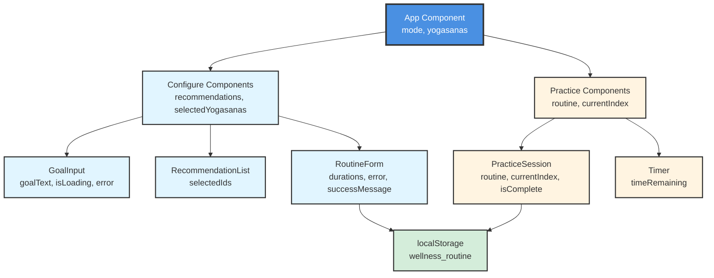
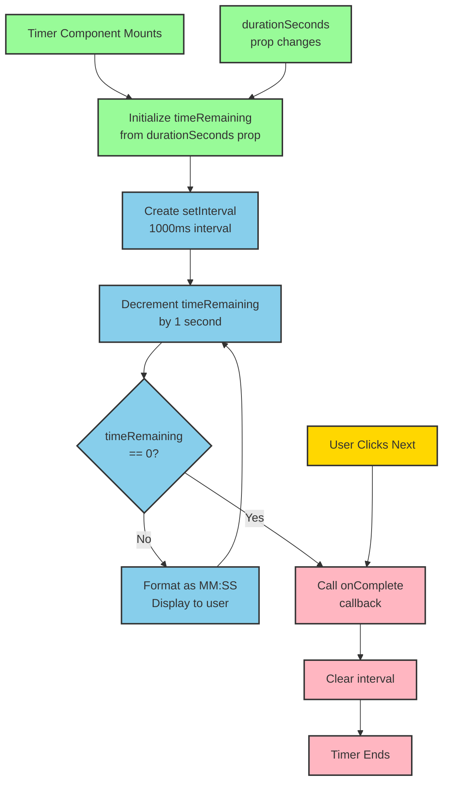
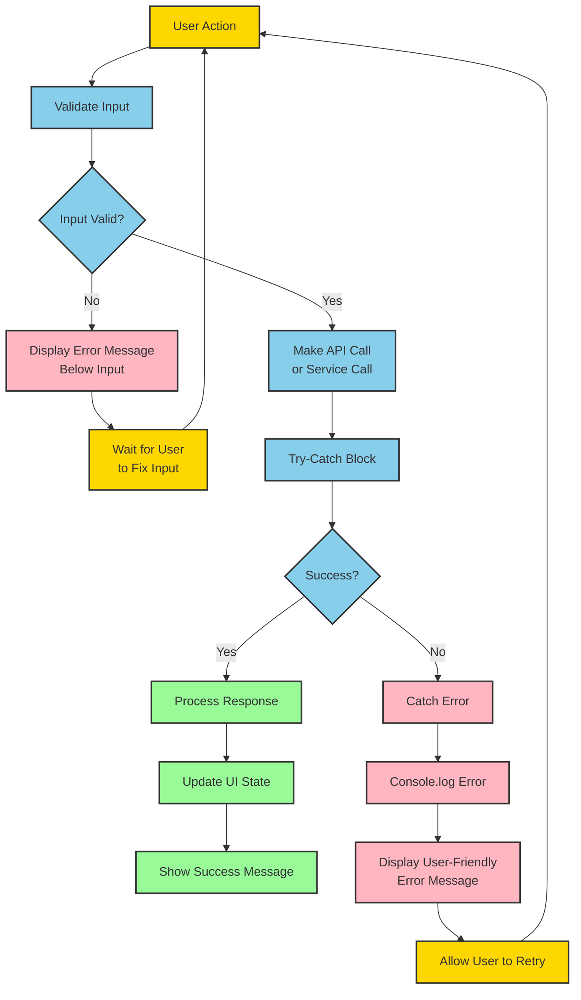

# Architecture: Wellness Guide

## 1. Application Flow

## 2. Component Structure

## 3. Data Flow - Configure Mode

## 4. Data Flow - Practice Mode

## 5. Service Layer Architecture

## 6. State Management

## 7. Timer Logic

## 8. Error Handling Flow

